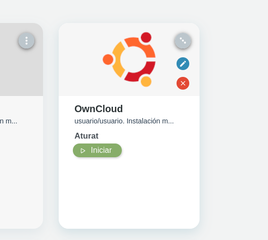
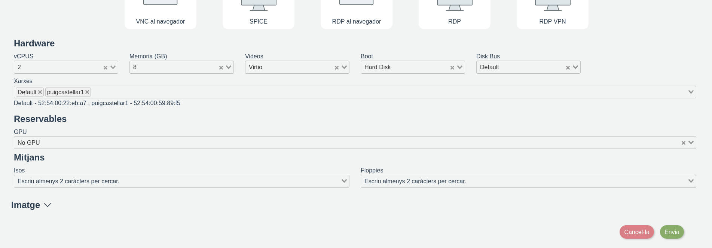
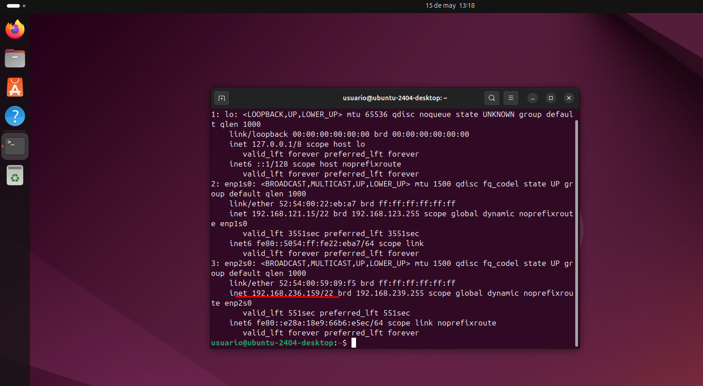
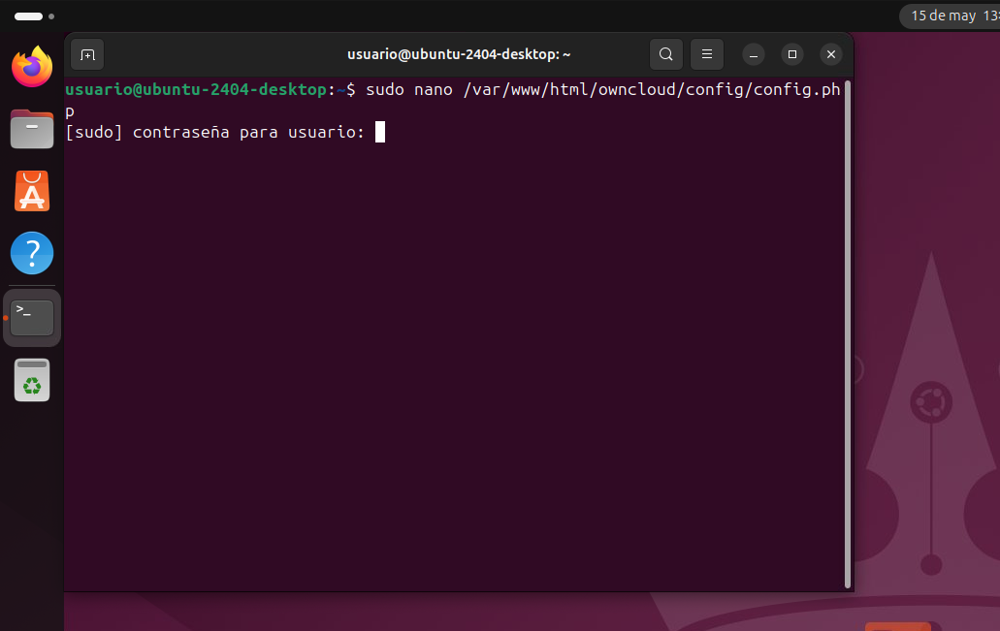
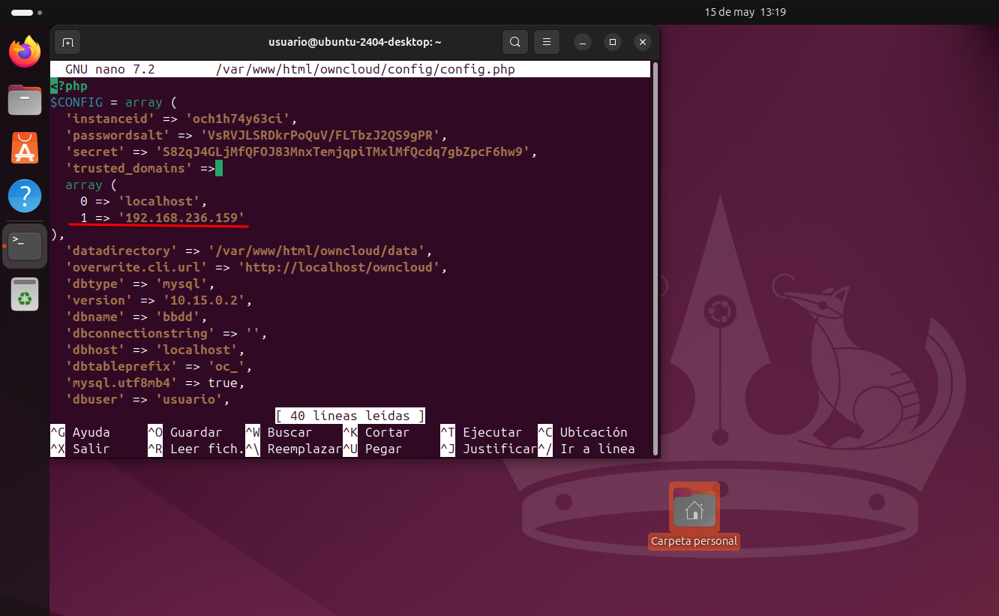

# Manual de configuración de OwnCloud

Este documento explica paso a paso cómo instalar y configurar ownCloud en un entorno virtual, ilustrado con capturas reales del proceso.

---

## 1. Inicio del proceso de configuración

Abrimos un navegador web y accedemos a localhost, ahí se almacenara OwnCloud. Hacemos clic donde pone `owncloud/`


## 2. Configuramos la cuenta de administrador

Crearemos la cuenta de adminitrador con el nombre de usuario que queramos y con nuestra contraseña, también hay que añadir la información que obtuvimos despues de la instalacion.
La cual es la siguiente:

1. Información BBDD:
   - **Usuario de BD**: usuario
   - **Contraseña de BD**: password
   - **Nombre de BD**: bbdd
   - **Servidor**: localhost


## 3. Inicio de sesion

Iniciamos sesion con el nombre de usuario y contraseña escogida en el paso anterior.


## 4. Creación de usuarios

Para hacer esta parte de la configuración tendremos que hacer clic arriba a la derecha, en la parte que pone el nombre, seguidamente entrareis al apartado llamado **Users**, en el cual tendreis que crear dos usuarios y dos grupos llamados **Visualitzador** y **Editor**, un usuario creado tiene que ir a un grupo diferente, en la parte de arriba verás unos recuadros que pone:

# | [Username](#) | [E-Mail](#) | [Groups ▼](#) | [Create](#) |

En esos recuadros tendras que crear los usuarios, en el apartado de **Groups** selecciona **Editor** o **Visualitzador**, crea dos usuarios, uno para cada grupo.


## 5. Compartir ficheros y asignar permisos

Para hacer este paso necesitaremos crear una carpeta o utilizar una existente, haremos clic en el signo de compartir.

Iremos al apartado llamado **Sharing** exactamente a **Users and Groups**, seleccionaremos el nombre de los grupos a los que les queremos modificar los permisos, le daremos al icono de la tuerca para modificarlos y seleccionaremos los permisos que nosotros queramos.


En la siguiente foto se puede ver que al iniciar sesión con un usuario al cual le has modificado los permisos no puede compartir los ficheros:


En esta foto se puede ver que el usuario tiene permisos de creación de archivos dentro de la carpeta compartida:


## 6. Administración de archivos

Para utilizar los **Public links** necesitaremos ir al apartado de **Sharing**, sea de una carpeta ya creada o nueva, volveremos a seleccionar los permisos para cada grupo, seguidamente a la derecha de **User and Groups** veremos la opción de **Public links**, haremos clic, pondremos el nombre del link, los permisos que les queremos asignar, una contraseña y la expiración, le damos a **Share** y tendremos nuestro public link.


## 7. Acceso remoto a owncloud

En este paso configuraremos el acceso remoto a owncloud desde un otra red diferente.

Dentro de **IsardVDI** le daremos a editar nuestra maquina, bajaremos hasta encontrar la parte que dice **Xarxes** y seleccionaremos la que se llama **puigcastellar1**, a continuación le daremos a enviar y entraremos a la maquina.





Después de acceder a la maquina virtual, utilizaremos el siguiente comando para ver nuestra ip:

```bash
ip -c a
```
 

Esa ip es la que utilizaremos para poder acceder desde otra red a nuestra owncloud.

 

Seguidamente utilizaremos el siguiente comando dentro de la maquina virtual:

```bash
sudo nano /var/www/html/owncloud/config/config.php
```
Aqui tendremos que modificar el config.php con la ip que hemos obtenido del comando anterior:

 

Justo debajo de: **0 => 'localhost'**

Añadiremos otra linea en la cual ponga lo siguiente: **1 => '**ip obtenida del primer comando**'**
La coma que aparece después de la comillas habrá que eliminarla para que funcione el acceso a owncloud desde la ip, aqui va un ejemplo de como no se tiene que ver y como si se tiene que ver:

**MAL:**
```bash
1 => '192.168.236.159',
```
**BIEN:**
```bash
1 => '192.168.236.159'
```
Después de esto haremos **Ctrl + O** para guardar el config.php y **Ctrl + X** para salir del config.php.

Comprobaremos el acceso a la owncloud desde cualquier otro dispositivo, utilizando la ip obtenida.

Si tienes acceso a la owncloud ya tendrás toda la configuración realizada correctamente.
