# Manual de Instalación y Configuración de Aplicaciones Web

## Introducción

Este manual describe el proceso completo para instalar y configurar un entorno de servidor web con Apache2 y MySQL, así como la instalación de una aplicación web en dicho entorno. El directorio raíz por defecto de Apache2 es `/var/www/html`, donde deberemos colocar los archivos de nuestra aplicación para acceder a ella mediante `http://localhost`.

## Instalación y configuración de OwnCloud

Este documento explica cómo instalar diferentes plataformas cloud en un servidor web.

## Descargar OwnCloud

### OwnCloud Server
https://download.owncloud.com/server/stable/owncloud-complete-20240724.zip

## Instalación PHP 7.4

Para instalar OwnCloud necesitaremos PHP 7.4. Sigue estos pasos para instalarlo:

Actualiza las listas de paquetes e instala los prerrequisitos:

```bash
sudo apt install software-properties-common -y
```
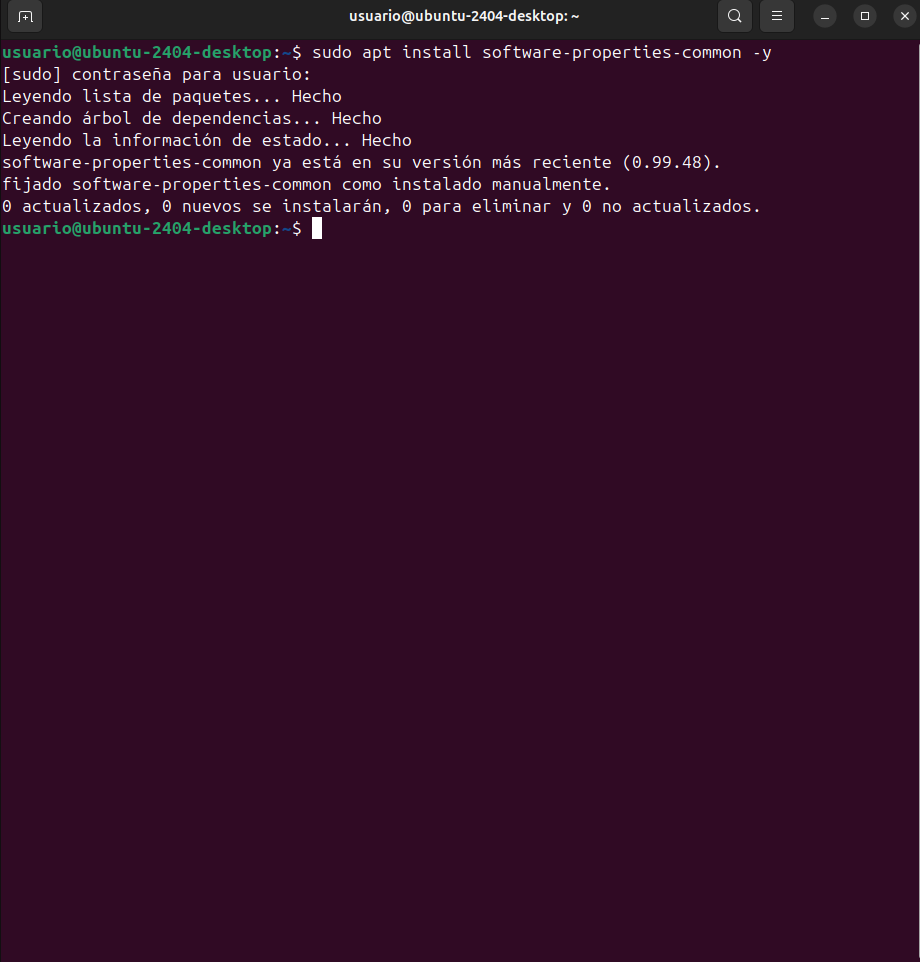

Instalación de herramientas necesarias:

```bash
LC_ALL=C.UTF-8 sudo add-apt-repository ppa:ondrej/php -y
```
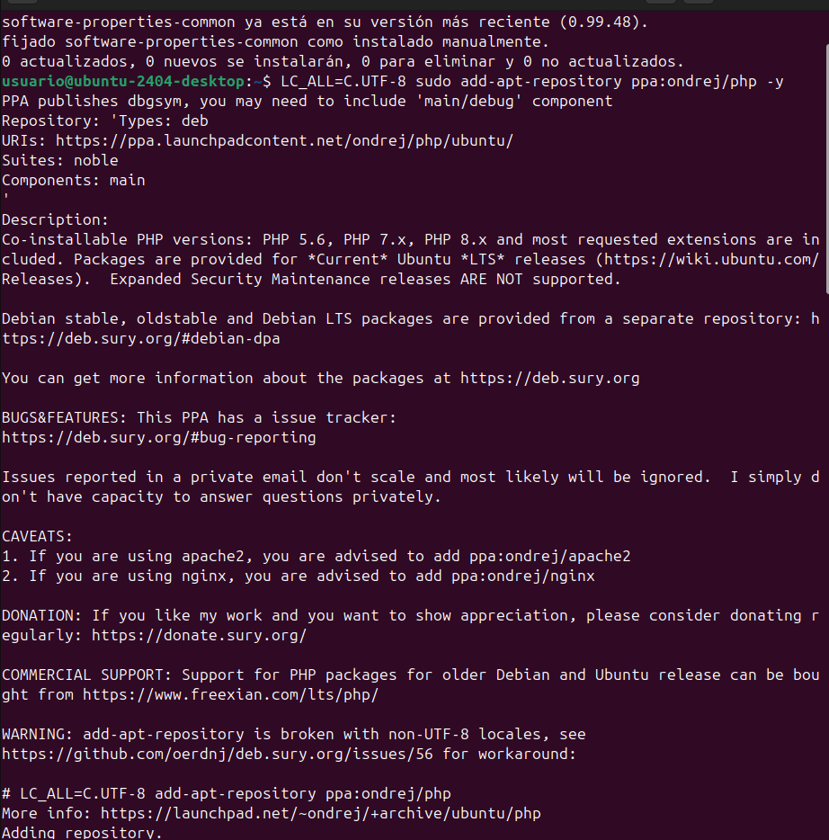

Actualiza los repositorios:

```bash
sudo apt update
```
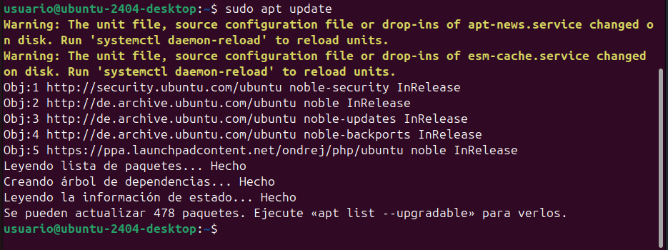

Instala PHP 7.4:

```bash
sudo apt install php7.4 -y
```
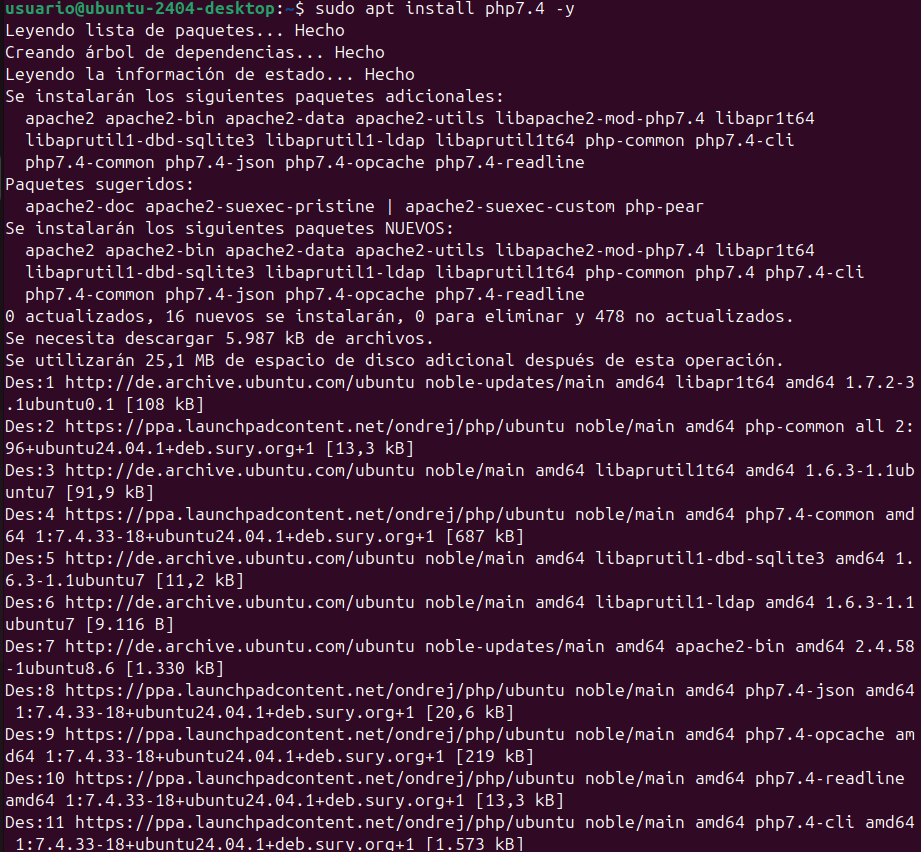

Instala las librerias de apache2:

```bash
sudo apt install -y php libapache2-mod-php7.4
```
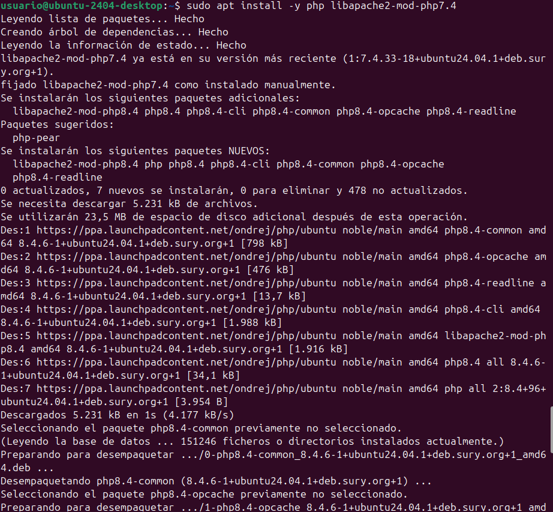

```bash
sudo apt install -y php7.4-fpm php7.4-common php7.4-mbstring php7.4-xmlrpc php7.4-soap php7.4-gd php7.4-xml php7.4-intl php7.4-mysql php7.4-cli php7.4-ldap php7.4-zip php7.4-curl
```
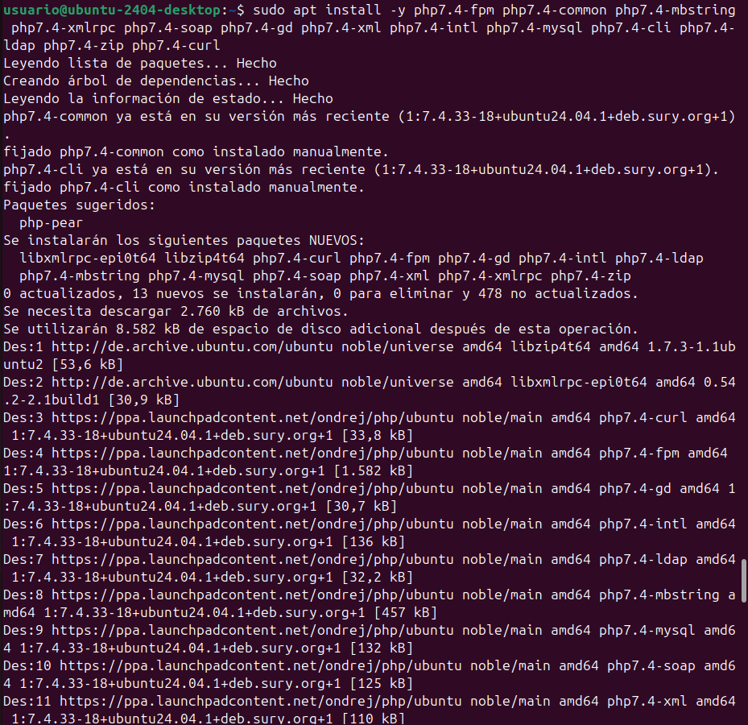

Configura la versión de PHP:

```bash
sudo update-alternatives --config php
```
Tendremos que seleccionar la versión que acabamos de instalar, la cual es PHP 7.4, marcaremos el numero en el que salga la version instalada, en este caso el numero 1.

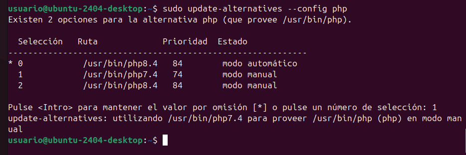

Activa los módulos de Apache:

```bash
sudo a2enmod proxy_fcgi setenvif
```
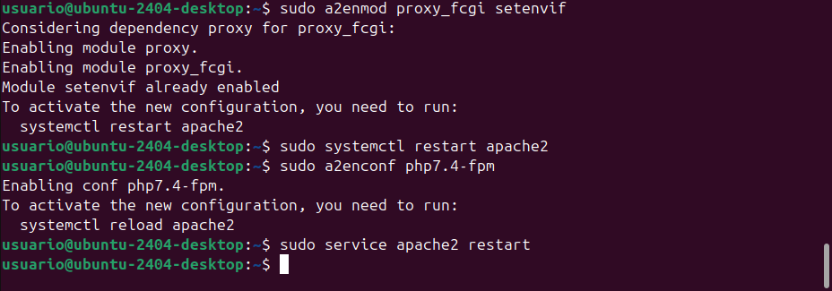

```bash
sudo a2enconf php7.4-fpm
```


Reinicia el servidor Apache:

```bash
sudo service apache2 restart
```


## 1. Preparación del entorno

### 1.1. Actualización del sistema

Antes de comenzar, actualizamos los repositorios y el sistema:

```bash
sudo apt update
sudo apt upgrade
```
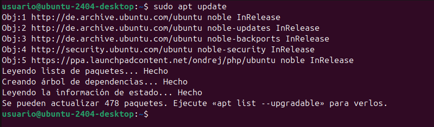

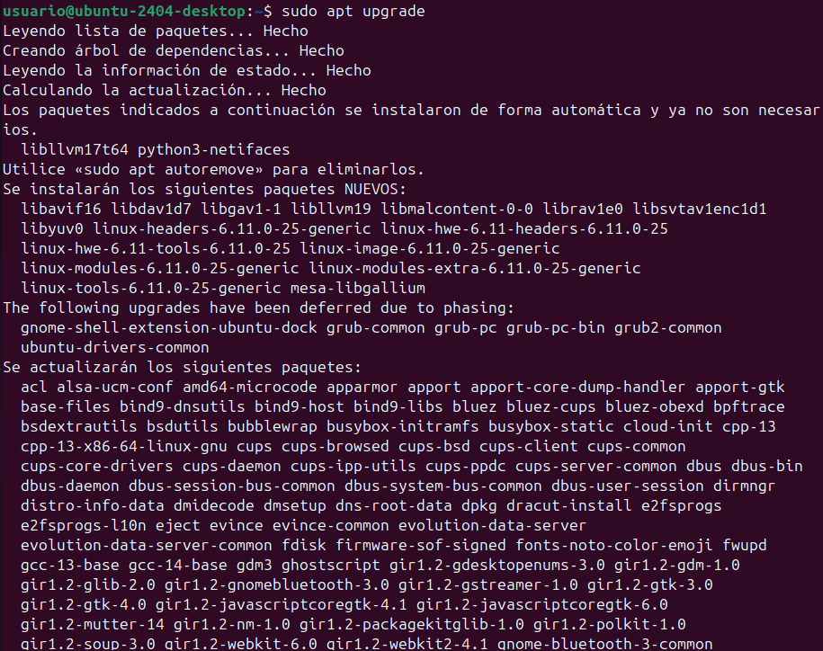

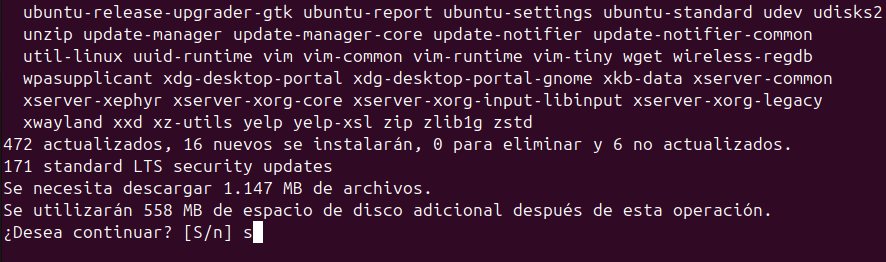

### 1.2. Instalación de Apache2, MySQL, PHP, etc...

#### Instalación del servidor web Apache2

```bash
sudo apt install -y apache2
```
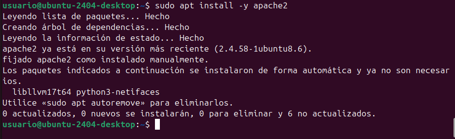

#### Instalación del servidor de base de datos MySQL

```bash
sudo apt install -y mysql-server
```
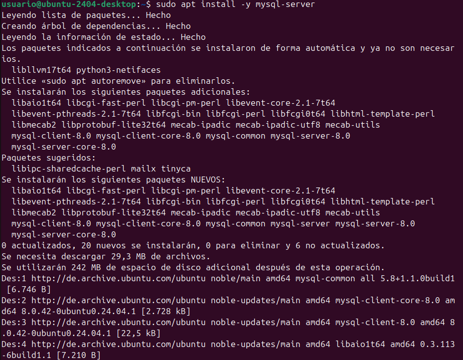

#### Instalación de PHP

```bash
sudo apt install -y php libapache2-mod-php
sudo apt install -y php-fpm php-common php-mbstring php-xmlrpc php-soap php-gd php-xml php-intl php-mysql php-cli php-ldap php-zip php-curl
```


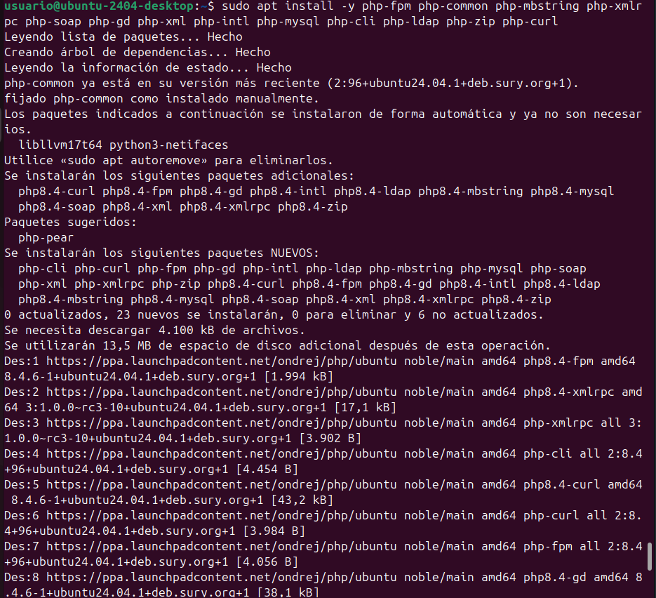

### 1.3. Reiniciar servidor Apache2

```bash
sudo systemctl restart apache2
```


## 2. Configuración de MySQL

### 2.1. Acceso a la Consola MySQL

```bash
sudo mysql
```
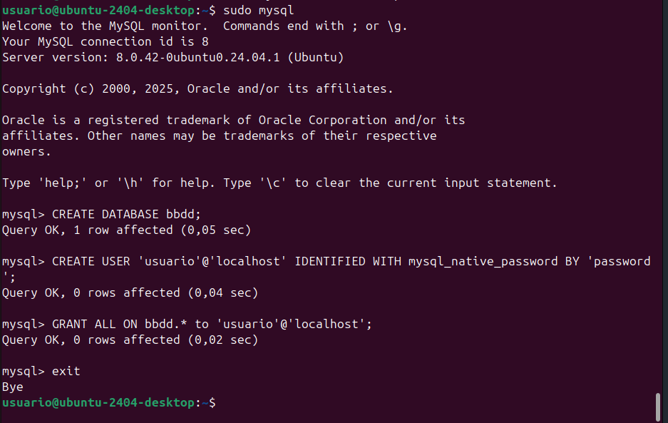

### 2.2. Creación de la base de datos

Ejecutamos dentro de la consola MySQL:

```bash
CREATE DATABASE bbdd;
```


### 2.3. Creación de usuario y asignación de permisos

```bash
CREATE USER 'usuario'@'localhost' IDENTIFIED WITH mysql_native_password BY 'password';
GRANT ALL ON bbdd.* to 'usuario'@'localhost';
exit
```


## 3. Instalación de la aplicación web

### 3.1. Copiar y descomprimir ownCloud

```bash
sudo cp ~/Descargas/app-web.zip /var/www/html
cd /var/www/html
sudo unzip app-web.zip
sudo cp -R app-web/. /var/www/html
sudo rm -rf app-web/
```


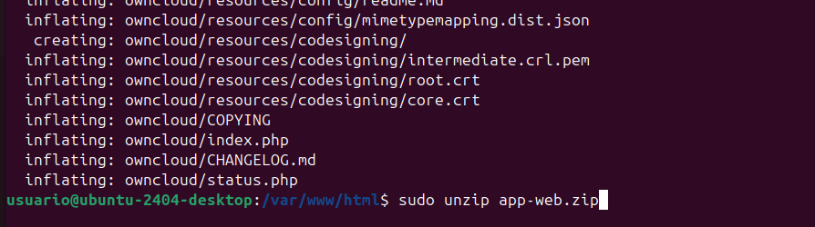


### 3.2. Eliminación de index.html

```bash
sudo rm -rf /var/www/html/index.html
```


### 3.3. Configuración de permisos

```bash
cd /var/www/html
sudo chmod -R 775 .
sudo chown -R usuario:www-data .
```


## 4. Acceso a ownCloud con los siguientes datos

1. Abra su navegador web
2. Ingrese la URL: `http://localhost`
3. Siga el asistente de instalación de la aplicación web
4. Configure con los siguientes datos:
   - **Usuario de BD**: usuario
   - **Contraseña de BD**: password
   - **Nombre de BD**: bbdd
   - **Servidor**: localhost
