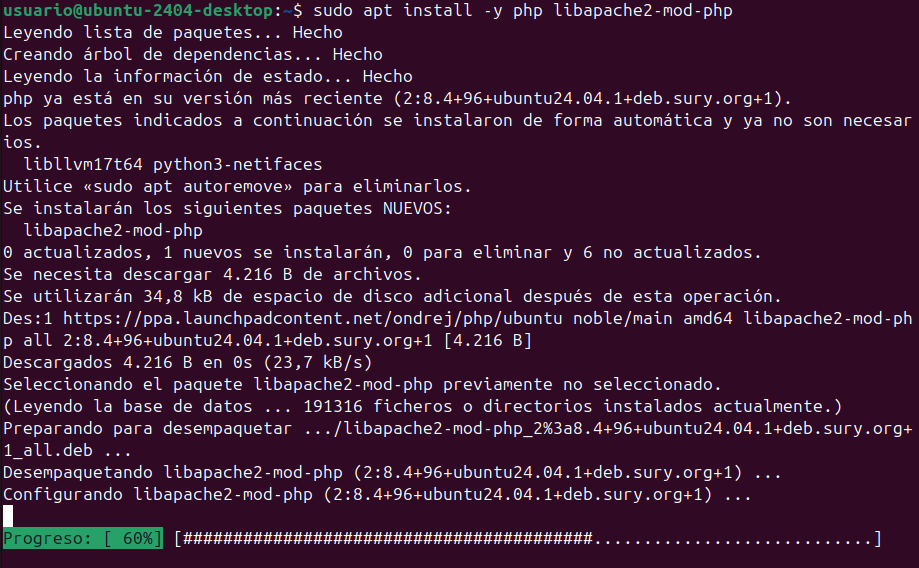

# Manual de Instalación y Configuración de Aplicaciones Web

## Introducción

Este manual describe el proceso completo para instalar y configurar un entorno de servidor web con Apache2 y MySQL, así como la instalación de una aplicación web en dicho entorno. El directorio raíz por defecto de Apache2 es `/var/www/html`, donde deberemos colocar los archivos de nuestra aplicación para acceder a ella mediante `http://localhost`.

1. Preparación del sistema
bash
# Instalar prerrequisitos
sudo apt install software-properties-common -y

# Añadir repositorio de PHP
LC_ALL=C.UTF-8 sudo add-apt-repository ppa:ondrej/php -y

# Actualizar repositorios
sudo apt update
2. Instalación de PHP y módulos
bash
# Instalar PHP 7.4 base
sudo apt install php7.4 -y

# Integrar con Apache
sudo apt install -y php libapache2-mod-php7.4

# Instalar extensiones necesarias
sudo apt install -y php7.4-fpm php7.4-common php7.4-mbstring php7.4-xmlrpc php7.4-soap php7.4-gd php7.4-xml php7.4-intl php7.4-mysql php7.4-cli php7.4-ldap php7.4-zip php7.4-curl
3. Configuración final
bash
# Seleccionar versión de PHP
sudo update-alternatives --config php

# Activar módulos de Apache
sudo a2enmod proxy_fcgi setenvif
sudo a2enconf php7.4-fpm

# Reiniciar Apache
sudo service apache2 restart


## 1. Preparación del entorno

### 1.1. Actualización del sistema

Antes de comenzar, actualizamos los repositorios y el sistema:

```bash
sudo apt update
sudo apt upgrade
```


### 1.2. Instalación de Apache2, MySQL, PHP, etc...

#### Instalación del servidor web Apache2

```bash
sudo apt install -y apache2
```


#### Instalación del servidor de base de datos MySQL

```bash
sudo apt install -y mysql-server
```


#### Instalación de PHP

```bash
sudo apt install -y php libapache2-mod-php
sudo apt install -y php-fpm php-common php-mbstring php-xmlrpc php-soap php-gd php-xml php-intl php-mysql php-cli php-ldap php-zip php-curl
```



### 1.3. Reiniciar servidor Apache2

```bash
sudo systemctl restart apache2
```


## 2. Configuración de MySQL

### 2.1. Acceso a la Consola MySQL

```bash
sudo mysql
```


### 2.2. Creación de la base de datos

Ejecutamos dentro de la consola MySQL:

```bash
CREATE DATABASE bbdd;
```


### 2.3. Creación de usuario y asignación de permisos

```bash
CREATE USER 'usuario'@'localhost' IDENTIFIED WITH mysql_native_password BY 'password';
GRANT ALL ON bbdd.* to 'usuario'@'localhost';
exit
```


## 3. Instalación de la aplicación web

### 3.1. Copiar y descomprimir ownCloud

```bash
sudo cp ~/Descargas/app-web.zip /var/www/html
cd /var/www/html
sudo unzip app-web.zip
sudo cp -R app-web/. /var/www/html
sudo rm -rf app-web/
```


### 3.2. Eliminación de index.html

```bash
sudo rm -rf /var/www/html/index.html
```


### 3.3. Configuración de permisos

```bash
cd /var/www/html
sudo chmod -R 775 .
sudo chown -R usuario:www-data .
```


## 4. Acceso a ownCloud con los siguientes datos

1. Abra su navegador web
2. Ingrese la URL: `http://localhost`
3. Siga el asistente de instalación de la aplicación web
4. Configure con los siguientes datos:
   - **Usuario de BD**: usuario
   - **Contraseña de BD**: password
   - **Nombre de BD**: bbdd
   - **Servidor**: localhost
