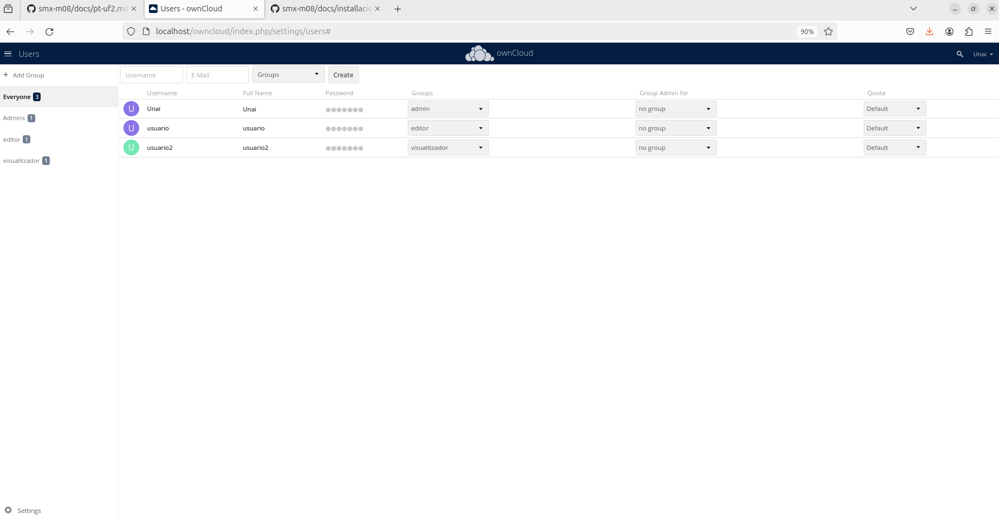
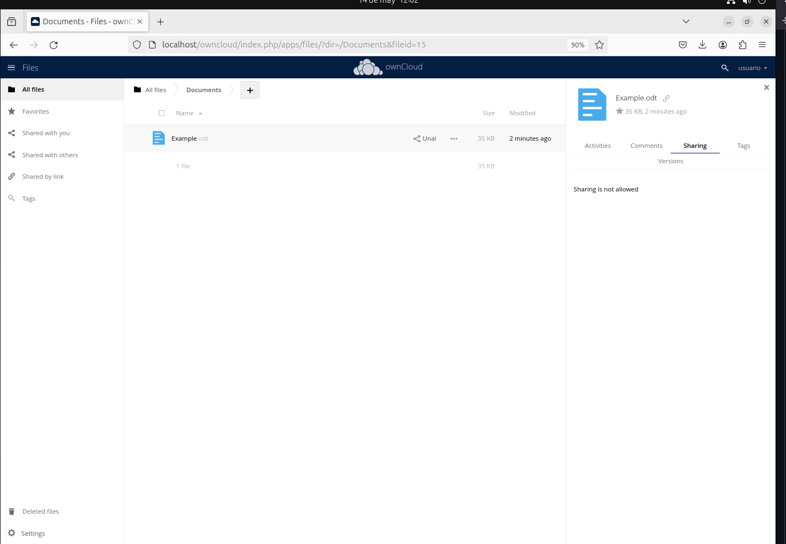
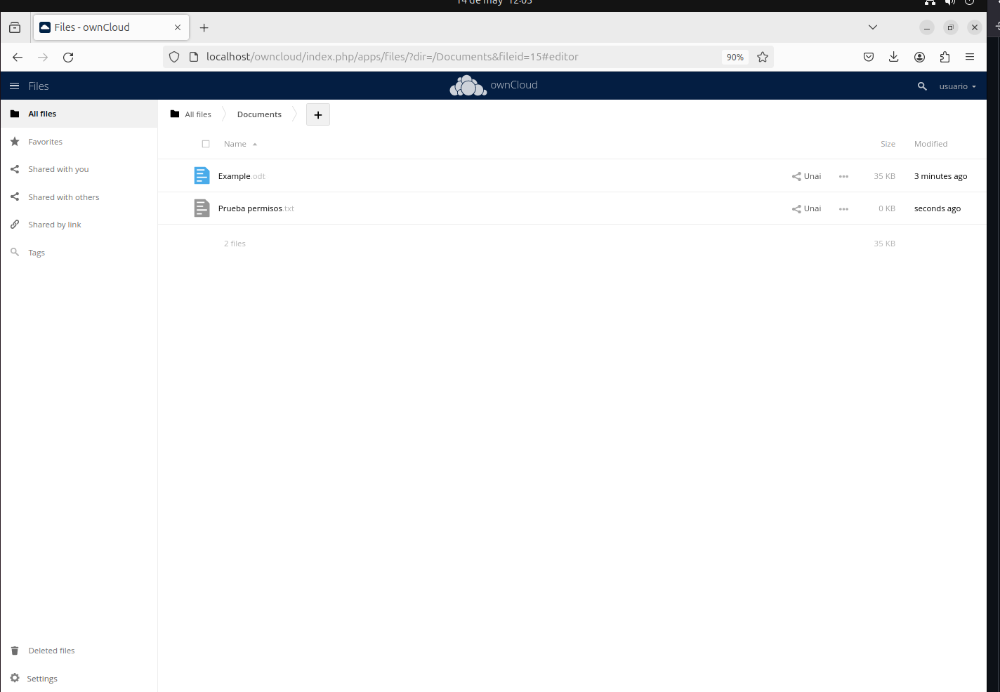
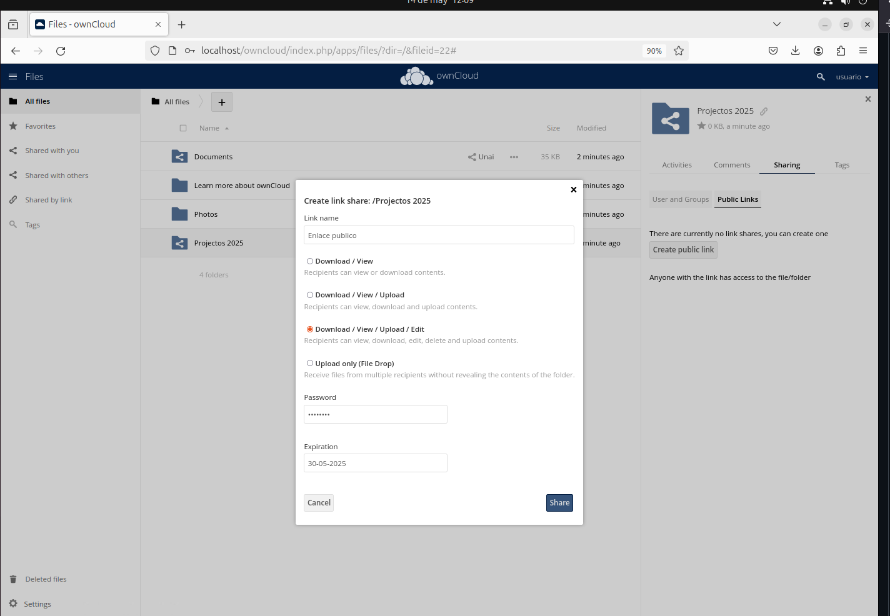
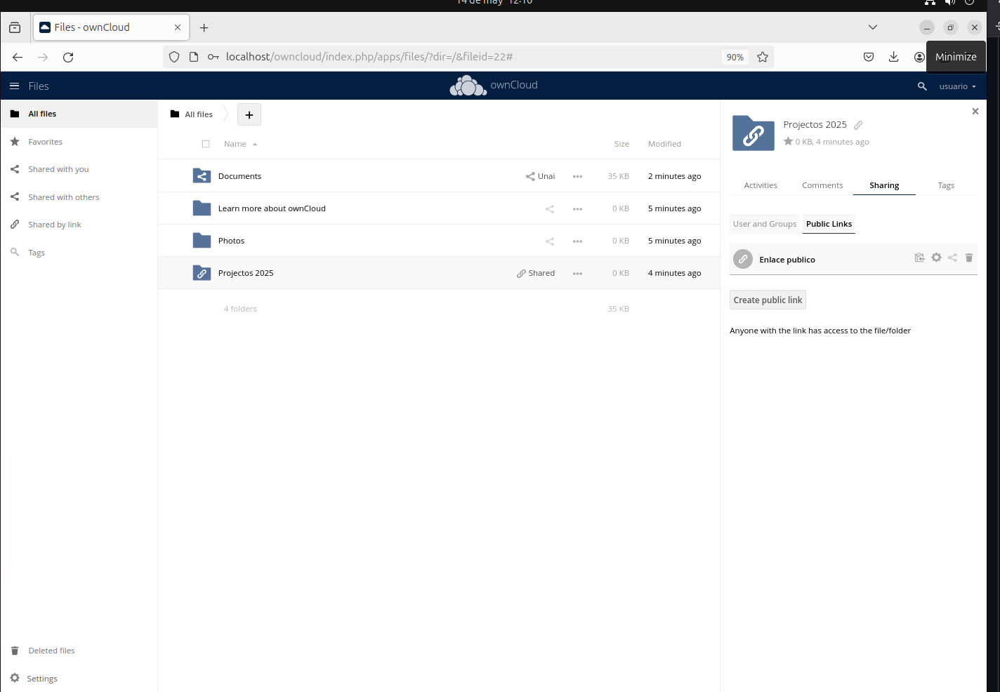

# Manual de Instalación y Configuración de ownCloud

Este documento explica paso a paso cómo instalar y configurar ownCloud en un entorno virtual, ilustrado con capturas reales del proceso.

---

## 1. Inicio del proceso de instalación

Abrimos un navegador web y accedemos a la dirección IP del servidor donde se instalará ownCloud. Esto nos lleva a la página inicial del instalador.

---

## 2. Configuración del usuario administrador

Introducimos un nombre de usuario y contraseña para el administrador. También seleccionamos el directorio de almacenamiento de datos.

---

## 3. Configuración de la base de datos

Seleccionamos el tipo de base de datos (MySQL/MariaDB), e introducimos el usuario, contraseña, y nombre de la base de datos. Confirmamos la instalación.

---

## 4. Proceso de instalación

Una vez introducidos todos los datos, ownCloud comienza la instalación de los componentes y configuración interna del sistema.

---

## 5. Acceso a la interfaz principal

Tras la instalación, se accede al escritorio web de ownCloud, donde se muestra la interfaz de usuario con opciones de archivos, configuración, etc.

---

## 6. Subida de archivos y organización

Se pueden subir archivos, crear carpetas y organizarlas fácilmente desde la interfaz gráfica.

---

## 7. Creación y gestión de usuarios

Desde la sección de configuración, es posible crear nuevos usuarios y asignarles roles como administrador, editor o lector.

---

## 8. Compartición de archivos

Los usuarios pueden compartir archivos o carpetas mediante enlaces públicos, con opciones como fecha de caducidad o protección por contraseña.

---

## 9. Configuración de seguridad

El administrador puede establecer políticas de acceso, permisos y controlar las actividades dentro del entorno cloud.

---

## 10. Verificación del entorno

Finalmente, se comprueba que ownCloud funciona correctamente, con usuarios conectados, archivos compartidos y sincronización activa.

---

> 📌 Asegúrate de tener los servicios de Apache/Nginx y MySQL/MariaDB correctamente configurados antes de iniciar la instalación.
